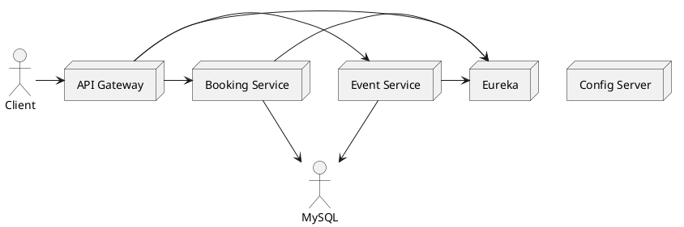

# Event Management Platform

## Description

Plateforme microservices pour la gestion d'événements (création d'événements, consultation, réservation/booking). Ce repository contient plusieurs services Spring Boot orchestrés via Eureka, Config Server et un API Gateway. Le projet est configuré pour être conteneurisé avec Docker et démarrable localement via `docker-compose`.

## Structure du repository

- `api-gateway/` : point d'entrée (Spring Cloud Gateway) et routage vers les microservices.
- `event-service/` : gestion des événements (CRUD, recherche).
- `booking-service/` : gestion des réservations.
- `eureka-server/` : registre de services pour la découverte.
- `config-server/` : serveur de configuration centralisé (Spring Cloud Config).
- `docker-compose.yml` : orchestration locale de l'ensemble (DB, services, etc.).

## Architecture (haut niveau)

Client (Web / Mobile)
  |
  v
API Gateway (route, load-balance, circuit-breaker)
  |
  v
Eureka (Service Registry) <-> Config Server
  |
  +--> Event Service (JPA/MySQL)
  +--> Booking Service (JPA/MySQL)

Diagramme ASCII :

```
            +-------------+
            |   Clients   |
            +------+------+            +----------------+
                   |                   | Configuration  |
                   v                   |   Server       |
            +------+------+            +----------------+
            | API Gateway |<---------> Eureka Server
            +------+------+            +----------------+
          /      |       \
         v       v        v
  +-------------+  +-------------+   +-------------+
  | Event SVR   |  | Booking SVR |   | Other SVR   |
  +-------------+  +-------------+   +-------------+
        |                 |
        v                 v
     MySQL DB          MySQL DB
```

## Composants principaux

- Spring Cloud Gateway (API Gateway)
- Spring Cloud Netflix Eureka (Service Registry)
- Spring Cloud Config (Configuration centralisée)
- Spring Boot (microservices)
- Spring Data JPA + MySQL (persistance)
- OpenFeign (clients déclaratifs)
- Resilience4j (circuit breaker)
- Actuator (monitoring / health)
- Lombok, MapStruct (aide au développement)
- Docker / Docker Compose

## Technologies et versions (extraites des POMs)

- Java: 17
- Spring Boot: 3.2.0 (majorité des modules), note: `booking-service` indique `4.0.1` — vérifier cohérence
- Spring Cloud: 2023.0.0
- MapStruct: 1.5.5.Final
- MySQL Connector/J: (utilisé comme driver JDBC)
- Maven Wrapper: inclus (`mvnw`, `mvnw.cmd`)
- Docker, Docker Compose: requis pour exécution conteneurisée

Remarque : certaines sous-applications peuvent utiliser une version différente de Spring Boot (voir `booking-service/pom.xml`). Il est recommandé d'aligner toutes les versions Spring Boot / Spring Cloud avant un déploiement en production.

## Configuration

Chaque service possède un `application.properties` dans `src/main/resources`. Le `config-server` permet de centraliser ces configurations (si un dépôt Git est configuré).

Variables d'environnement usuelles (exemples) :

- `SPRING_PROFILES_ACTIVE` : profil Spring (dev, prod)
- `SPRING_DATASOURCE_URL` : JDBC URL vers MySQL
- `SPRING_DATASOURCE_USERNAME` / `PASSWORD`
- `EUREKA_CLIENT_SERVICEURL_DEFAULTZONE` : URL du serveur Eureka

## Exécution locale (sans Docker)

1. Installer Java 17 et Maven ou utiliser les wrappers fournis.
2. Lancer les services dans l'ordre (Eureka, Config Server, DB, puis services métier, puis API Gateway) :

```bash
# Depuis le dossier de chaque module, ex :
cd eureka-server
./mvnw spring-boot:run

cd ../config-server
./mvnw spring-boot:run

cd ../event-service
./mvnw spring-boot:run

cd ../booking-service
./mvnw spring-boot:run

cd ../api-gateway
./mvnw spring-boot:run
```

## Exécution avec Docker Compose

1. Assurez-vous d'avoir Docker et Docker Compose installés.
2. Depuis la racine du projet :

```bash
docker-compose up --build
```

Cela construira les images si nécessaire et démarrera les conteneurs (Eureka, Config, DB, services, gateway). Consultez `docker-compose.yml` pour les détails des services exposés et des ports.

## Base de données

Le projet utilise MySQL (via `mysql-connector-j`). Les scripts de création peuvent être présents dans les modules ou gérés via Hibernate (DDL auto). Vérifier `application.properties` pour le paramétrage `spring.jpa.hibernate.ddl-auto`.

## Tests

Chaque module contient des tests unitaires (dossier `src/test`). Exécuter depuis la racine :

```bash
./mvnw clean test -T 1C
```

## CI / CD (suggestions)

- Ajouter une pipeline (GitHub Actions / GitLab CI) qui :
  - Compile les modules (`mvn -T 1C clean package`)
  - Exécute les tests
  - Génère des images Docker et les pousse vers un registry

## Diagrammes et assets

- Diagramme d'architecture (recommandé) : exporter un diagramme visuel (draw.io, Lucidchart, PlantUML) basé sur la section "Architecture" ci-dessus.
- Exemple PlantUML (à coller dans un .puml) :



Vous pouvez générer une image PNG via PlantUML ou utiliser `plantuml` en local.

## Bonnes pratiques et remarques

- Aligner toutes les versions Spring Boot (incohérence détectée avec `booking-service`).
- Externaliser les secrets (ne pas versionner les mots de passe dans Git).
- Ajouter des health-checks et endpoints de readiness/liveness via Actuator.
- Configurer la persistance et backups pour les bases MySQL en production.

## Contribution

1. Fork du projet
2. Créer une branche feature/bugfix
3. Ouvrir une Pull Request décrivant les changements

## Licence

Indiquer la licence du projet (ex: MIT, Apache-2.0) dans le fichier `LICENSE`.

---

Fichier généré automatiquement par assistant — vérifier et ajuster les sections `Technologies et versions` selon vos besoins et la cohérence des POMs avant déploiement en production.
